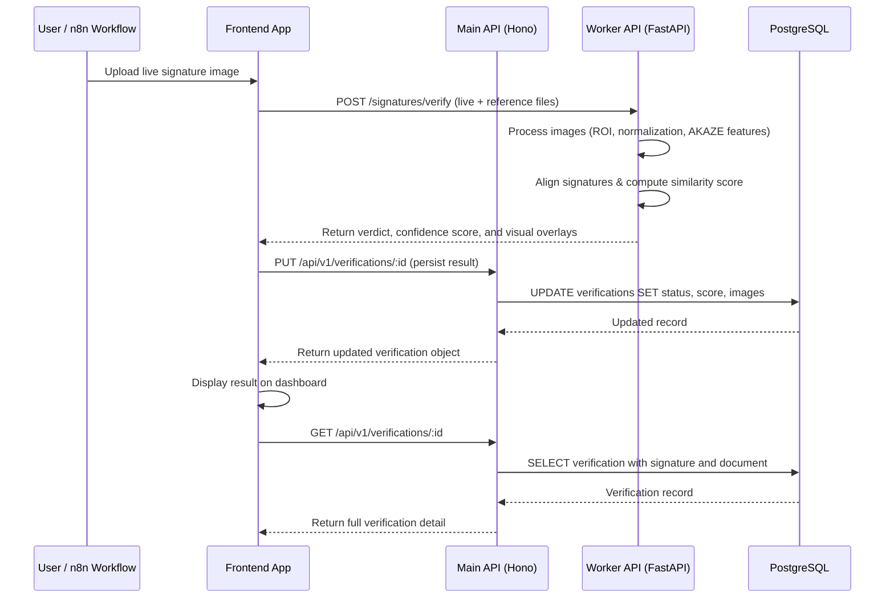

# API Documentation

## API Overview

Medcurial AI Claims Fraud Detection exposes two separate HTTP services:

| Service | Base URL | Technology | Purpose |
|---|---|---|---|
| **Main API** | `http://localhost:3000/api/v1` | Hono.js on Bun | CRUD operations for signatures, verifications, and documents |
| **Worker API** | `http://localhost:8000` | FastAPI (Python) | Signature processing, fingerprinting, and verification computation |

All responses are JSON. The Main API is the primary consumer-facing interface; the Worker API is called internally by the n8n workflow orchestrator.

---

## Authentication

The current implementation does **not** enforce authentication. All endpoints are publicly accessible in the development environment. In production, it is recommended to place both services behind a reverse proxy (e.g., NGINX) and enforce token-based authentication (e.g., JWT or API keys) at the gateway layer.

---

## Main API Endpoints

### Base URL: `/api/v1`

#### Signatures

| Method | Endpoint | Description |
|---|---|---|
| `GET` | `/signatures` | List all registered reference signatures |
| `GET` | `/signatures/:id` | Get a single signature with its logs, verifications, and documents |

#### Verifications

| Method | Endpoint | Description |
|---|---|---|
| `GET` | `/verifications` | List all verification records |
| `GET` | `/verifications/:id` | Get a single verification with its signature and document |
| `PUT` | `/verifications/:id` | Update a verification record (e.g., status, scores) |

#### Documents

| Method | Endpoint | Description |
|---|---|---|
| `GET` | `/documents` | List all documents with their verification and overall score |
| `GET` | `/documents/:id` | Get a single document with full relational data |

#### Health

| Method | Endpoint | Description |
|---|---|---|
| `GET` | `/` | Health check — returns plain text `Hello Hono!` |

---

## Worker API Endpoints

### Base URL: `/signatures`

| Method | Endpoint | Description |
|---|---|---|
| `POST` | `/signatures/capture-fingerprint` | Process a signature image and generate a 128-dim fingerprint |
| `POST` | `/signatures/verify` | Compare a live signature against a reference and return a verdict |
| `GET` | `/` | Health check — returns `{ status: "online", worker: "Signature Verification" }` |

---

## Request / Response Examples

### `GET /api/v1/signatures`

**Response `200 OK`:**
```json
[
  {
    "id": "sig_abc123",
    "no": 1,
    "name": "Dr. John Smith",
    "email": "john.smith@hospital.org",
    "imageUrl": "https://storage.example.com/signatures/sig_abc123.png",
    "previewImageUrl": "https://storage.example.com/signatures/sig_abc123_preview.png",
    "createdAt": "2024-06-01T10:00:00.000Z",
    "updatedAt": "2024-06-01T10:00:00.000Z"
  }
]
```

---

### `GET /api/v1/signatures/:id`

**Response `200 OK`:**
```json
{
  "id": "sig_abc123",
  "name": "Dr. John Smith",
  "imageUrl": "https://storage.example.com/signatures/sig_abc123.png",
  "previewImageUrl": "https://storage.example.com/signatures/sig_abc123_preview.png",
  "logs": [
    { "id": "log_001", "imageUrl": "...", "type": "capture", "createdAt": "..." }
  ],
  "verifications": [
    { "id": "ver_001", "isAuthentic": true, "similarityScore": 0.92, "status": "authentic" }
  ],
  "documents": [
    { "id": "doc_001", "name": "claim_form.pdf", "status": "analyzed" }
  ]
}
```

**Response `404 Not Found`:**
```json
{ "error": "Signature not found" }
```

---

### `PUT /api/v1/verifications/:id`

**Request Body:**
```json
{
  "status": "authentic",
  "isAuthentic": true,
  "similarityScore": 0.91
}
```

**Response `200 OK`:**
```json
{
  "id": "ver_001",
  "signatureId": "sig_abc123",
  "isAuthentic": true,
  "similarityScore": 0.91,
  "status": "authentic",
  "updatedAt": "2024-06-10T12:00:00.000Z"
}
```

**Response `404 Not Found`:**
```json
{ "error": "Verification not found" }
```

---

### `POST /signatures/capture-fingerprint`

**Request:** `multipart/form-data`

| Field | Type | Required | Description |
|---|---|---|---|
| `file` | image file | Yes | The signature image to process |

**Response `200 OK`:**
```json
{
  "message": "Fingerprint captured successfully",
  "data": {
    "id": "550e8400-e29b-41d4-a716-446655440000",
    "fingerprint": [0.82, 0.64, 0.12, "...128 values..."],
    "processed_images": {
      "vis": { "id": "...", "image": "<base64>", "type": "vis" },
      "roi": { "id": "...", "image": "<base64>", "type": "roi" },
      "normalized": { "id": "...", "image": "<base64>", "type": "normalized" },
      "preview": { "id": "...", "image": "<base64>", "type": "preview" }
    },
    "metadata": { "width": 256, "height": 128 }
  }
}
```

---

### `POST /signatures/verify`

**Request:** `multipart/form-data`

| Field | Type | Required | Description |
|---|---|---|---|
| `file` | image file | Yes | The live (query) signature image |
| `reference_file` | image file | Yes | The reference signature image |

**Response `200 OK`:**
```json
{
  "message": "Verification completed successfully",
  "data": {
    "id": "...",
    "is_authentic": true,
    "status": "authentic",
    "confidence_score": 0.8743,
    "confidence_percentage": "87.43%",
    "visuals": {
      "overlap_viz": { "id": "...", "image": "<base64>", "type": "overlap_viz" },
      "live_normalized": { "id": "...", "image": "<base64>", "type": "live_normalized" },
      "reference_normalized": { "id": "...", "image": "<base64>", "type": "reference_normalized" },
      "preview_live_normalized": { "id": "...", "image": "<base64>", "type": "preview_live_normalized" },
      "preview_ref_normalized": { "id": "...", "image": "<base64>", "type": "preview_ref_normalized" },
      "preview_overlap_viz": { "id": "...", "image": "<base64>", "type": "preview_overlap_viz" }
    }
  }
}
```

---

## Error Handling

### Main API Error Responses

| HTTP Status | Condition | Example Response |
|---|---|---|
| `404 Not Found` | Resource does not exist | `{ "error": "Signature not found" }` |
| `500 Internal Server Error` | Unexpected server error | `{ "error": "Internal server error" }` |

### Worker API Error Responses

| HTTP Status | Condition | Example Response |
|---|---|---|
| `400 Bad Request` | Invalid file type | `{ "detail": "Invalid file type. Only image files are allowed." }` |
| `400 Bad Request` | File read error | `{ "detail": "Error reading file: <message>" }` |
| `500 Internal Server Error` | Processing or verification failure | `{ "detail": "Verification failed: <message>" }` |

---

## Rate Limiting

Rate limiting is not currently enforced at the API layer. For production deployments, it is recommended to configure rate limiting at the reverse proxy level (e.g., NGINX `limit_req` or a cloud API gateway).

---

## API Flow Diagram

### Title: Signature Verification API Flow



**Diagram Explanation:**

This sequence diagram illustrates the complete lifecycle of a signature verification request:

1. **User Initiates Verification** — The user uploads a live signature through the frontend application.
2. **Worker Processing** — The Worker API receives both the live and reference signature images. It processes each image through a pipeline: Region of Interest (ROI) extraction, normalization, and AKAZE feature detection. It then aligns the query signature to the reference and computes a multi-factor similarity score combining overlap, structural similarity (SSIM), and feature match quality.
3. **Verdict Assignment** — Based on the final score, a verdict is assigned: `authentic` (≥ 0.80), `needs-review` (≥ 0.70), or `forged` (< 0.70).
4. **Persistence** — The frontend calls the Main API to persist the result, including the base64-encoded visual overlays and the confidence score, into PostgreSQL via Drizzle ORM.
5. **Dashboard Display** — The verification detail is fetched and displayed to the user with all supporting visuals.
