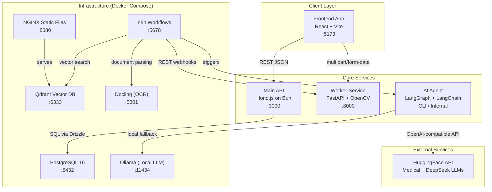
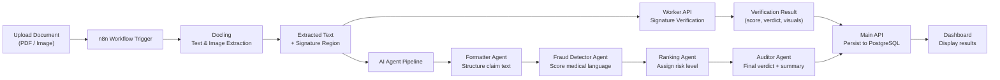

# Technical Documentation

## System Architecture

Medcurial AI Claims Fraud Detection is composed of four independently deployable services that communicate over HTTP:

| Service | Technology | Port | Role |
|---|---|---|---|
| **Frontend App** | React + Vite + TanStack Router | 5173 | User interface |
| **Main API** | Hono.js on Bun + Drizzle ORM | 3000 | Business logic & data persistence |
| **Worker** | FastAPI (Python) + OpenCV | 8000 | Computer vision & signature analysis |
| **Agent** | LangGraph + LangChain | CLI / internal | LLM-powered document fraud analysis |

Supporting infrastructure (via Docker Compose):

| Service | Port | Purpose |
|---|---|---|
| PostgreSQL 16 | 5432 | Relational data store |
| n8n | 5678 | Workflow orchestration |
| Qdrant | 6333 | Vector database for RAG |
| Docling | 5001 | Document parsing and OCR |
| Ollama | 11434 | Local LLM inference |
| NGINX (static-files) | 8080 | Static file server for shared assets |

---

## Tech Stack

### Frontend

| Technology | Version | Purpose |
|---|---|---|
| React | 18+ | UI framework |
| TanStack Router | latest | File-based routing |
| Vite | latest | Dev server and bundler |
| TypeScript | 5+ | Type safety |
| Bun | latest | Runtime and package manager |
| shadcn/ui + Radix UI | latest | Component library |
| TanStack Query | latest | Server state management |

### Main API

| Technology | Version | Purpose |
|---|---|---|
| Hono | latest | HTTP framework |
| Bun | latest | JavaScript runtime |
| Drizzle ORM | latest | Type-safe SQL ORM |
| drizzle-zod | latest | Schema validation |
| PostgreSQL | 16 | Primary database |
| TypeScript | 5+ | Type safety |

### Worker

| Technology | Version | Purpose |
|---|---|---|
| Python | 3.12+ | Runtime |
| FastAPI | latest | HTTP framework |
| OpenCV (cv2) | latest | Image processing and feature detection |
| scikit-image | latest | SSIM structural similarity |
| NumPy | latest | Array and matrix operations |
| uv | latest | Dependency management |

### Agent

| Technology | Version | Purpose |
|---|---|---|
| Python | 3.12+ | Runtime |
| LangGraph | latest | Agent workflow orchestration |
| LangChain | latest | LLM abstraction layer |
| langchain-openai | latest | OpenAI-compatible LLM calls |
| InMemorySaver | latest | In-process state checkpointing |

---

## Core Modules / Components

### Main API (`api/src/`)

| Module | File | Responsibility |
|---|---|---|
| HTTP Server | `index.ts` | Route definitions and request handling |
| Database Client | `db.ts` | Drizzle ORM instance connected to PostgreSQL |
| Schema — Signatures | `schema/signatures.ts` | `signatures` and `signature_logs` table definitions |
| Schema — Verifications | `schema/verifications.ts` | `verifications` table with Zod validation types |
| Schema — Documents | `schema/documents.ts` | `documents` table with all analysis score fields |
| Schema — Overall | `schema/overall.ts` | `overall_scores` table for final fraud verdicts |
| Utilities | `utils.ts` | Shared `baseSchema` (id, timestamps) and Zod helpers |

### Worker (`worker/app/`)

| Module | File | Responsibility |
|---|---|---|
| FastAPI App | `main.py` | Route definitions for `/capture-fingerprint` and `/verify` |
| Signature Processor | `service/processor.py` | Image preprocessing, ROI extraction, normalization |
| Signature Analyzer | `service/analyzer.py` | AKAZE feature extraction, alignment, similarity scoring |

### Agent (`agent/`)

| Module | File | Responsibility |
|---|---|---|
| Agent Entry Point | `main.py` | LangGraph state machine definition and execution |
| Prompt Loader | `prompt_loader.py` | Loads prompt templates from the `prompt/` directory |
| Prompts | `prompt/` | System prompt files for each agent node |

### Frontend App (`app/src/`)

| Module | Path | Responsibility |
|---|---|---|
| Routes | `routes/` | File-based page routing via TanStack Router |
| API Clients | `api/` | HTTP client wrappers for signature, verification, and document APIs |
| Components | `components/` | Reusable UI components (nav, evaluation, kanban, badges) |
| Providers | `components/provider/` | Theme and React Query context providers |

---

## Database Design

### Entity Relationship Overview

All tables share a common `baseSchema`:
- `id` (TEXT, primary key)
- `no` (SERIAL, auto-increment)
- `created_at` (TIMESTAMP)
- `updated_at` (TIMESTAMP)

### Table: `signatures`

| Column | Type | Notes |
|---|---|---|
| `id` | TEXT | Primary key |
| `name` | TEXT | Signer's name |
| `email` | TEXT | Optional contact email |
| `image_url` | TEXT | URL to the original signature image |
| `preview_image_url` | TEXT | URL to a preview/thumbnail image |

### Table: `signature_logs`

| Column | Type | Notes |
|---|---|---|
| `signature_id` | TEXT | FK → `signatures.id` (CASCADE DELETE) |
| `image_url` | TEXT | Image URL for this log entry |
| `type` | TEXT | Log type (e.g., `capture`) |

### Table: `verifications`

| Column | Type | Notes |
|---|---|---|
| `signature_id` | TEXT | FK → `signatures.id` (SET NULL on delete) |
| `query_image_url` | TEXT | URL of the live query signature image |
| `is_authentic` | BOOLEAN | Whether the signature was deemed authentic |
| `similarity_score` | DOUBLE | Raw similarity score (0.0–1.0) |
| `status` | TEXT | `authentic` \| `needs-review` \| `forged` |
| `preview_image_url` | TEXT | Overlap visualization image |
| `preview_live_normalized_image_url` | TEXT | Live signature normalized preview |
| `preview_ref_normalized_image_url` | TEXT | Reference signature normalized preview |

### Table: `documents`

| Column | Type | Notes |
|---|---|---|
| `name` | TEXT | Document filename |
| `url` | TEXT | Stored document URL |
| `status` | TEXT | Processing status |
| `text` | TEXT | Extracted plain text |
| `markdown` | TEXT | Extracted markdown content |
| `final_rank` | TEXT | Overall fraud risk rank |
| `suspicion_type` | TEXT | Type of suspected fraud |
| `analysis_summary` | TEXT | AI-generated analysis summary |
| `medical_language_score` | DOUBLE | Medical language authenticity (0–1) |
| `protocol_score` | DOUBLE | Medical protocol adherence (0–1) |
| `linguistic_score` | DOUBLE | Linguistic authenticity (0–1) |
| `severity_score` | DOUBLE | Overall severity (0–1) |
| `signature_id` | TEXT | FK → `signatures.id` (CASCADE) |
| `verification_id` | TEXT | FK → `verifications.id` (CASCADE) |

### Table: `overall_scores`

| Column | Type | Notes |
|---|---|---|
| `score` | DOUBLE | Combined overall fraud score (0–1) |
| `document_id` | TEXT | FK → `documents.id` (CASCADE) |
| `verification_id` | TEXT | FK → `verifications.id` (CASCADE) |
| `verdict` | TEXT | Final verdict string |
| `signature_fraud_score` | DOUBLE | Contribution from signature analysis |
| `description_fraud_score` | DOUBLE | Contribution from description analysis |
| `final_rank` | TEXT | Final risk rank (e.g., `HIGH`, `LOW`) |
| `suspicion_type` | TEXT | Suspicion classification |
| `is_flagged_for_review` | BOOLEAN | Manual review flag |

---

## External Integrations

| Integration | Purpose | Communication |
|---|---|---|
| **n8n** | Workflow automation: triggers document processing and agent runs | REST webhooks |
| **Docling** | Document parsing and OCR from PDF/image inputs | HTTP REST API on port 5001 |
| **Qdrant** | Vector storage for RAG-based document retrieval | HTTP REST API on port 6333 |
| **Ollama** | Local LLM inference (fallback/offline model serving) | HTTP REST API on port 11434 |
| **HuggingFace / Featherless AI** | Remote LLM inference for medical and reasoning models | OpenAI-compatible API |

---

## Architecture Diagram

### Title: Medcurial AI Claims Fraud Detection — System Architecture

**Diagram Explanation:**

- **Client Layer**: The React frontend communicates directly with both the Main API (for data reads and writes) and the Worker (for signature processing).
- **Core Services**: The Main API acts as the data gateway to PostgreSQL. The Worker handles CPU-intensive image processing. The Agent is a standalone process invoked by n8n workflows.
- **Infrastructure**: All supporting services run in Docker containers on the same Docker network (`snn-signature-verif`). PostgreSQL persists all structured data. n8n orchestrates the document processing pipeline. Qdrant stores document embeddings for RAG queries. Docling parses raw document files. Ollama serves local LLMs as a fallback.
- **External Services**: The AI Agent calls HuggingFace-hosted LLMs via an OpenAI-compatible interface for medical fraud analysis.

---

## Data Flow Diagram

### Title: Document Fraud Analysis Data Flow

**Diagram Explanation:**

1. A user uploads a medical document through the frontend or n8n trigger.
2. Docling parses the document and extracts raw text and embedded images.
3. The extracted signature region is sent to the Worker API for biometric verification.
4. The extracted text is simultaneously processed by the four-node AI Agent pipeline.
5. Both outputs — the verification result and the AI fraud analysis — are persisted to PostgreSQL through the Main API.
6. The dashboard fetches and displays the combined results to the reviewer.
