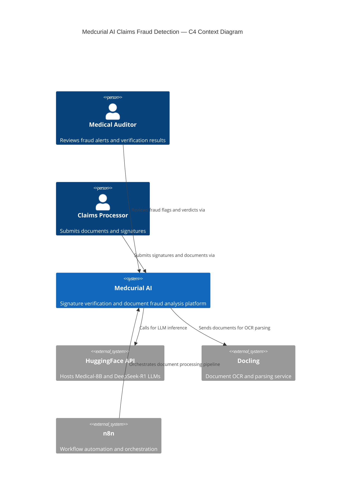
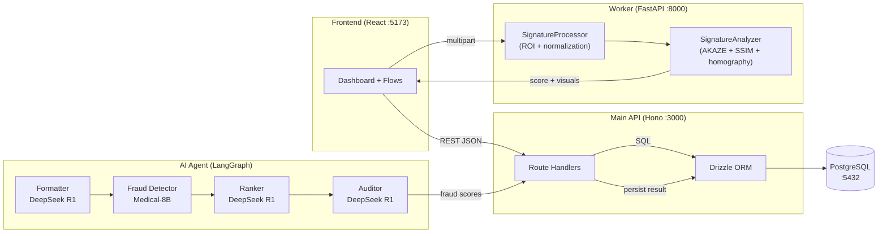

# Technical Overview

## System Design Summary

Medcurial AI Claims Fraud Detection is a multi-service platform that combines computer vision and large language model (LLM) reasoning to detect fraud in medical insurance claims. The system is designed as a set of loosely coupled microservices, each independently deployable and horizontally scalable.

The platform answers two core questions about every claim submission:
1. **Is the signature authentic?** — Answered by the computer vision Worker using Siamese Neural Network-inspired feature alignment.
2. **Is the medical claim description authentic?** — Answered by a four-node LangGraph AI agent pipeline using specialized medical and reasoning LLMs.

---

## High-Level Architecture for Engineers

---

## Component Interaction Diagram

**Explanation:**
- The frontend interacts with both the Main API (structured data) and the Worker (image processing) simultaneously.
- The Worker's `SignatureProcessor` handles raw image bytes and hands off cleaned images to `SignatureAnalyzer` for feature extraction and scoring.
- The AI Agent runs as a sequential pipeline of four LLM calls; each node receives the output of the previous node as its input.
- All persistent results flow through the Main API's Drizzle ORM layer into PostgreSQL.

---

## Key Technical Decisions and Trade-offs

### 1. AKAZE for Feature Extraction (vs. SIFT / ORB)

**Decision:** Use OpenCV's AKAZE detector for keypoint extraction.

**Rationale:**
- AKAZE is scale- and rotation-invariant, which is critical for signatures scanned at varying orientations.
- Unlike SIFT, AKAZE is patent-free and runs in real time without GPU hardware.
- ORB was considered but produces less discriminative descriptors for the irregular stroke patterns in handwriting.

**Trade-off:** AKAZE is slower than ORB for very large images. Signatures are pre-normalized to a standard canvas size to mitigate this.

---

### 2. Multi-Signal Similarity Score (vs. Single Metric)

**Decision:** Combine three signals — pixel overlap (50%), SSIM (30%), and AKAZE match quality (20%) — into a single score.

**Rationale:**
- Pixel overlap alone is susceptible to translation artifacts.
- SSIM alone can be fooled by globally similar but structurally different images.
- AKAZE feature matching alone fails on sparse or low-contrast signatures.
- Combining all three signals with a weighted average produces a more robust and calibrated result.

**Trade-off:** The weights (0.5 / 0.3 / 0.2) and the +0.15 base boost are empirically chosen. A data-driven threshold calibration on a labelled signature dataset would improve precision.

---

### 3. LangGraph for Agent Orchestration (vs. single LLM call)

**Decision:** Implement the fraud analysis as a four-node directed acyclic graph (DAG).

**Rationale:**
- Breaking the analysis into specialized nodes (formatting → fraud detection → ranking → auditing) mirrors a real human audit workflow.
- Each node uses the most appropriate model: `Medical-8B` for domain-specific scoring and `DeepSeek-R1` for reasoning and synthesis.
- LangGraph's `InMemorySaver` provides lightweight state checkpointing without requiring an external state store.

**Trade-off:** Running four sequential LLM API calls increases latency. This is acceptable for async document processing but would be inappropriate for real-time workflows.

---

### 4. Hono.js on Bun (vs. Express / Fastify)

**Decision:** Use Hono.js running on the Bun runtime for the Main API.

**Rationale:**
- Bun delivers significantly faster cold-start times and native TypeScript execution without transpilation overhead.
- Hono's chainable, type-safe API aligns well with the project's TypeScript-first approach.
- Drizzle ORM provides compile-time safe SQL queries without the overhead of a full ORM like Prisma.

**Trade-off:** Bun has a smaller ecosystem than Node.js. Some npm packages may have compatibility issues, though this is rare in practice for server-side HTTP workloads.

---

### 5. Docker Compose for Infrastructure (vs. Kubernetes)

**Decision:** Use Docker Compose as the infrastructure management layer.

**Rationale:**
- The project is in active development. Docker Compose provides zero-overhead local orchestration.
- All services run on the same `snn-signature-verif` bridge network, simplifying service discovery.
- Multiple hardware profiles (`cpu`, `gpu-nvidia`, `gpu-amd`) are defined as Compose profiles to support diverse developer machines.

**Trade-off:** Docker Compose does not provide automatic failover, rolling deployments, or pod autoscaling. A migration to Kubernetes would be needed for production-grade workloads.

---

## Data Integrity Design

- All primary keys are `TEXT` (UUID-format), set by the application layer rather than the database. This avoids integer overflow and enables distributed key generation.
- Foreign keys use `CASCADE DELETE` by default, ensuring orphaned records are automatically cleaned up.
- The `verifications.signature_id` FK uses `SET NULL` on delete, preserving verification history even if a reference signature is removed.
- All timestamps (`created_at`, `updated_at`) are managed by Drizzle's `defaultNow()` and `$onUpdate()` utilities, ensuring consistent server-side time handling.

---

## Security Considerations

| Area | Current State | Recommended Hardening |
|---|---|---|
| API Authentication | None (open endpoints) | Add JWT or API key middleware to Hono.js |
| CORS Policy | Locked to `localhost:5173` in dev | Configure per-environment allowed origins |
| Secret Management | `.env` files | Use a secrets manager (e.g., Vault, AWS Secrets Manager) in production |
| Image Input Validation | MIME type check only | Add size limits and magic-byte validation |
| Database Access | Direct connection string in env | Use connection pooling (PgBouncer) and least-privilege DB roles |
| LLM API Keys | Stored in `.env` | Rotate regularly; restrict API key scopes on HuggingFace |
